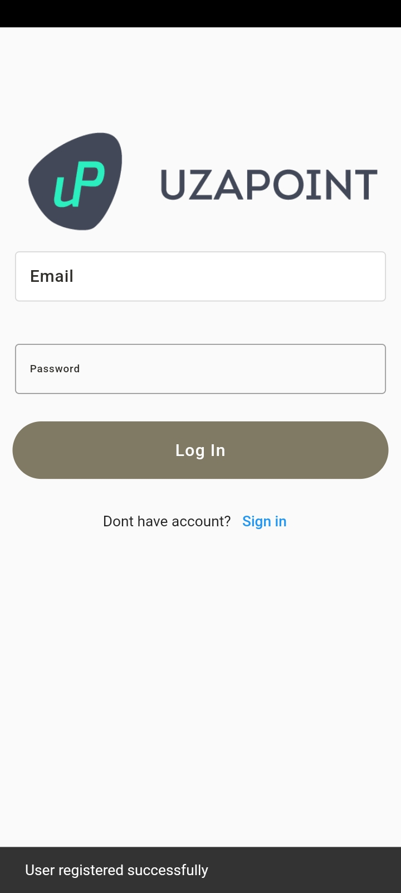

#UzaPoint Interview

## Description

The assessment task involves creating a "Contacts Manager App" that allows users to manage their contacts. You will be responsible for both the backend (Laravel) and the frontend (Flutter) development. The task is designed to evaluate your skills in web and mobile app development and your ability to work with RESTful APIs.

Task Details:

- Backend (Laravel):

  - Implement user authentication.

  - Develop contact management features, including creating, editing, deleting, and viewing contacts.

  - Enable users to organize contacts into lists or groups.

  - Implement RESTful API endpoints for user authentication, contact management, and contact lists.

- Frontend (Flutter):

  - Create a user-friendly UI for contact management.

  - Implement user authentication screens.

  - Allow users to view and manage their contacts and contact lists.

  - Include the ability to upload and change contact profile pictures.

  - Communicate with the Laravel backend through HTTP requests.

## Quick Start
This is a normal flutter app. You should follow the instructions in the [official documentation](https://flutter.io/docs/get-started/install).
This project uses **MVVM** (business logic component) [MvvM](https://betterprogramming.pub/how-to-use-mvvm-in-flutter-4b28b63da2ca) to separate the business logic with UI itself.

## Getting Started

1. Clone [Contacts api](https://github.com/collins-swai/contacts_api) to your machine
2.  Run **php artisan serve** in your terminal to get the server running and get something like this:

3. Install Ngrok in your laptop by running this command **brew install ngrok** 

4. Run the following command to make your local host link live **ngrok http http://localhost:8000**, where you will get this:

## Api Testing

This are some of the api end points I worked on :

- User Authentication:
    - Register a User:
    - Method: POST

    - Endpoint: /register

    - Description: Register a new user by providing a name, email, and password.

    -User Login:
    - Method: POST
    - Endpoint: /login
    - Description: Log in an existing user by providing their email and password.

- Contact Management:
    - Get All Contacts:
    - Method: GET
    - Endpoint: /contacts
    - Description: Retrieve a list of all contacts.

- Get a Specific Contact:
    - Method: GET
    - Endpoint: /contacts/{contact}
    - Description: Retrieve a specific contact by its ID.

- Create a New Contact:
    - Method: POST
    - Endpoint: /contacts
    - Description: Create a new contact by providing contact details (name, email, phone).

- Update an Existing Contact:
    - Method: PUT
    - Endpoint: /contacts/{contact}
    - Description: Update an existing contact by providing contact details (name, email, phone). Requires the contact's ID.

- Delete a Contact:
    - Method: DELETE
    - Endpoint: /contacts/{contact}
    - Description: Delete a contact by its ID.
    - User Lists or Groups (If Implemented):
- Get All Groups:
    - Method: GET
    - Endpoint: /groups
    - Description: Retrieve a list of all user groups.
- Get a Specific Group:
    - Method: GET
    - Endpoint: /groups/{group}
    - Description: Retrieve a specific group by its ID.
- Create a New Group:
    - Method: POST
    - Endpoint: /groups
    - Description: Create a new group by providing a group name.
- Update an Existing Group:
    - Method: PUT
    - Endpoint: /groups/{group}
    - Description: Update an existing group by providing a new group name. Requires the group's ID.
-   Delete a Group:
    - Method: DELETE
    - Endpoint: /groups/{group}
    - Description: Delete a group by its ID.

## Modularization Structure 🔥
# Root Project
    .
    │   
    |
    └── lib                        # Name of module (default from Flutter).
        |── core                   # Name of module.
        |── data                   # Network calls.
        ├── presentations          # Activity/View layer
        ├── theme                  # App styling themes.
        ├── widget                 # Styles for app.

## How to run the App
1. Clone this project.
2. Open with your favorite tools editor.
3. Run `Pub get` on each module sequentially starting from `dependencies`, `core`, `shared`, and `your root project` to generated `pubspec.lock` file.
4. Add your `ngrok link` into ***Network Service*** class file. Under Network, which is in in the Data folder and replace the BASE_URL link

# Screenshots
- Projects starts from the splash screen and goes to the movie details screen

Splash screen 

Register screen 

Login Screen 

New Contact Screen 

New Contact Screen Filled 

Get Contact Screen 

New Contact Group 

New Group Created 

Get Group 

## Thank you UzaPoint
I'd like to thank **UzaPoint**, and *every single individual* that helped in bringing this learning experience. Thank you!

